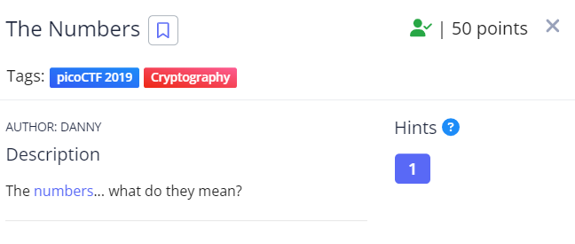
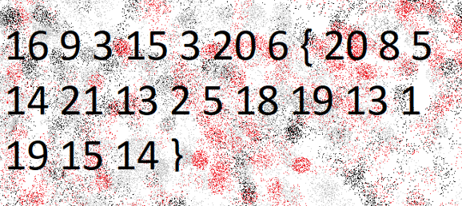

Nhìn vào ảnh ta thấy các số đều nhỏ hơn 26 rất có thể đây là thứ tự các chữ trong bảng chữ cái alphabet

Mình dùng web này để decode https://www.dcode.fr/letter-number-cipher và lấy được flag.

Flag: picoCTF{THENUMBERSMASON}