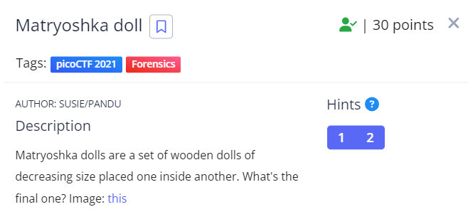
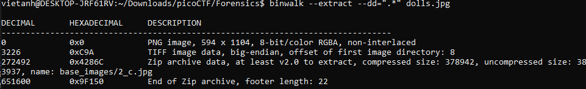

Matryoshka doll là một loại búp bê của Russia có các búp bê nhỏ hơn ở bên trong. Điều đó gợi ta đến việc rất có thể có các file ẩn trong hình.
Ta dùng binwalk để extract tất cả các file ẩn có trong file đó.

Sau khi extract file các file ẩn sẽ được extract ra một folder riêng. ta truy cập vào folder đó.

Từ đây ta thấy được có một file "2_c.jpg" nằm trong folder "base_images". Tiếp tục extract file "2_c.jpg ".
Cứ làm như vậy cho đến khi lấy được flag

Flag: picoCTF{4cf7ac000c3fb0fa96fb92722ffb2a32}