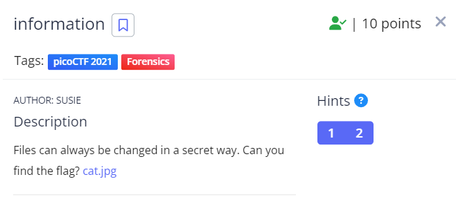
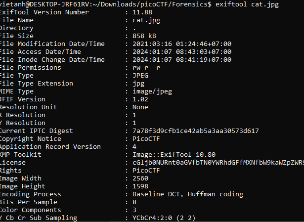

Đầu tiên thử tìm các xâu kí tự có trong ảnh nhưng ta không lấy được flag.
Theo như hints của bài ta xem các thông tin về ảnh bằng lệnh: exiftool <tên file>

Nhìn vào thông tin ta thấy rất có thể License đã được được mã hóa. Ta thử decode bằng bases64 và lấy được flag.

Flag: picoCTF{the_m3tadata_1s_modified}