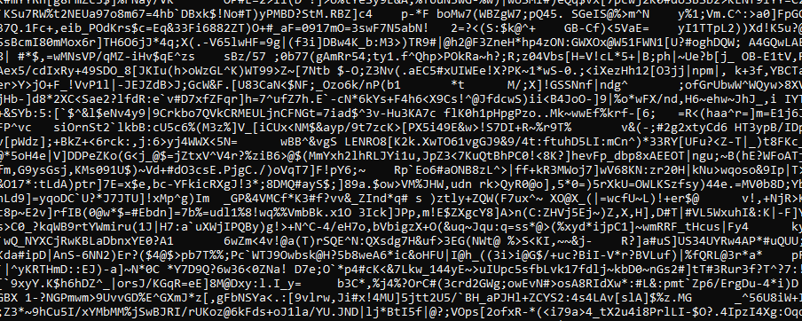

Thử kiểm tra file thì đầy là một file text.
Ta mở file ra thấy rất nhiều text vì vậy rất khó tìm flag.

Vì vậy ta dùng grep để tìm từ flag vì flag có dạng "pico{xxxxx}" nên ta dùng lệnh: strings <tên file> | grep pico

Flag: picoCTF{grep_is_good_to_find_things_dba08a45} 