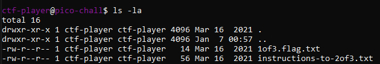

Truy cập vào user theo password đã được cung cấp.

Dùng lệnh "ls -la" để liệt kê tất cả đường folder. Ta thấy phần đầu của flag và hường dẫn lấy phần thứ 2.

Mở file "1of3.flag.txt " lấy được "picoCTF{xxsh_".

Theo như hướng dẫn ta chuyển đến root theo lệnh: cd /

Trong root ta thấy phần thứ 2 và hướng dẫn lấy phần thứ 3: "0ut_0f_\/\/4t3r_".

Theo như hướng dẫn ta chuyển đến home theo lệnh: cd ~

Trong home ta thấy phần thứ 3: "3ca613a1} "

Flag: picoCTF{xxsh_0ut_0f_\/\/4t3r_3ca613a1}

