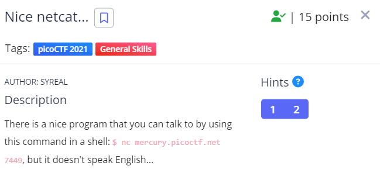

Kết nối với sever theo lệnh như yêu câu ta được các con số. Rất có thể đây là mã anscii.
Mình dùng web này để decode: https://kt.gy/tools.html#conv/ và lấy được flag.

Flag: picoCTF{g00d_k1tty!_n1c3_k1tty!_f2d7cafa}

