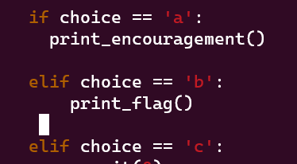

sau khi chạy code bài cho ta 3 lựa chọn trong đó có lựa chọn b để ỉn ra flag.
Nhưng sau khi chọn b thì terminal hiển thị rằng code lỗi và không có flag.
Vì vậy ta phải thêm hàm print_flag() vào hàm main rồi xóa đoạn code ở dưới rồi lưu file lại.
chạy lại chương trình ta lấy được flag

Flag:  picoCTF{7h3_r04d_l355_7r4v3l3d_aa2340b2}