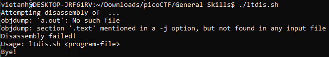

Thử thay đổi quyền thực thi của file "static" rồi chạy thử ta không thấy flag. 

Ta thử thay đổi quyền thực thi của file "ltdis.sh" rồi chạy thử.

ta sử dụng lệnh usage như đoạn scipt trên

Từ đoạn scipt trên ta nhận thấy rằng tất các các string có trong file static sẽ được viết vào file "static.ltdis.strings.txt"

Dùng lệnh strings "'static.ltdis.strings.txt' | grep pico" ta lấy được flag

Flag: picoCTF{d15a5m_t34s3r_f5aeda17}