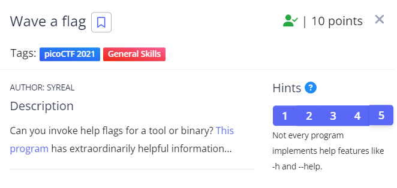
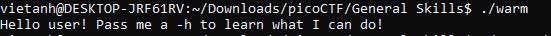

Sau khi tải file không thấy đuôi file. Vì vậy ta dùng lệnh "file <tên file>"" để kiểm tra xem đây là file gì.

Sau khi kiểm tra ta biết được đây là một file nhị phân.
Để chạy được file này ta cần thay đổi quyền thực thi bằng lệnh "chmod +x <tên file>"
Sau đó để chạy file ta dùng lệnh "./<tên file>".
Sau khi chạy file màn hình terminal sẽ như sau: 

Làm theo yêu cầu ta lấy được flag.

Flag:  picoCTF{b1scu1ts_4nd_gr4vy_616f7182}