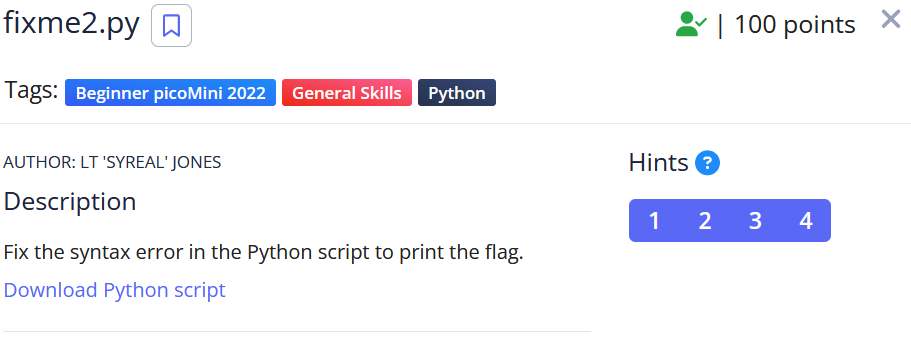
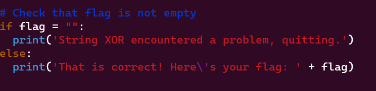

Sau khi down code về chạy thử thì thấy bị lỗi. Check source code thì thấy lỗi do điều kiên ìf không đúng.

ở đây dấu '=' để gán giá trị còn dấu '==' để so sánh hai giá trị.

Flag: picoCTF{3qu4l1ty_n0t_4551gnm3nt_f6a5aefc}