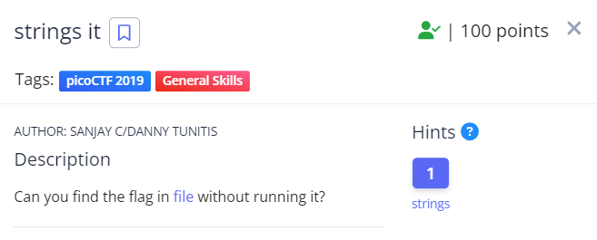
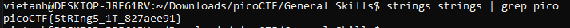

Như đề bài thì bài này dùng "strings".

Nhưng khi dùng ta dùng lệnh "strings <tên file>" thì sẽ có rất nhiều từ trong file. Vì vậy ta cần dùng thêm grep để tìm từ bắt đầu bằng từ "pico" vì flag có dạng là pico{xxxxx}.

Flag: picoCTF{5tRIng5_1T_827aee91} 