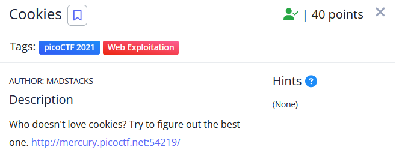
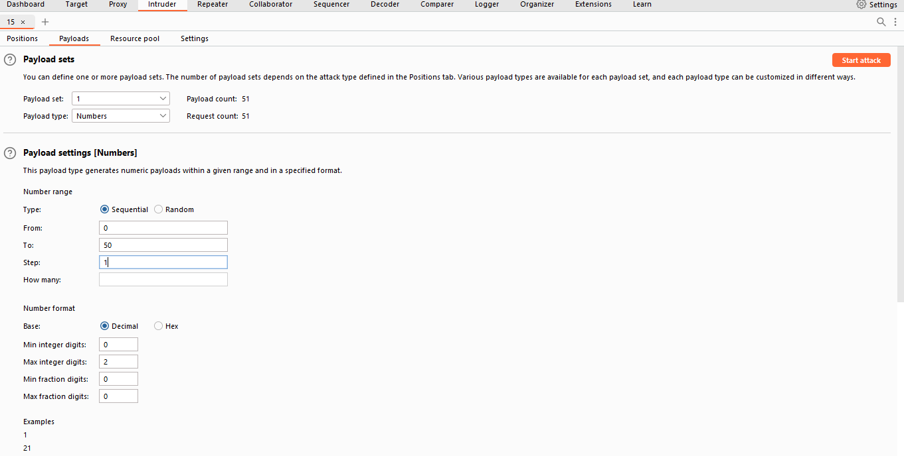
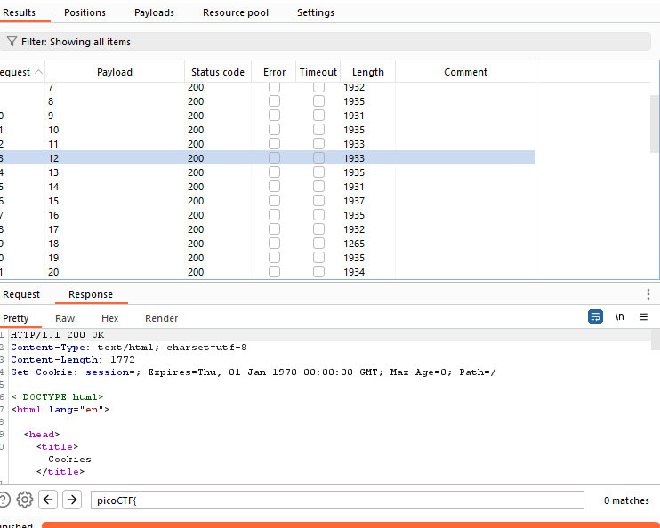
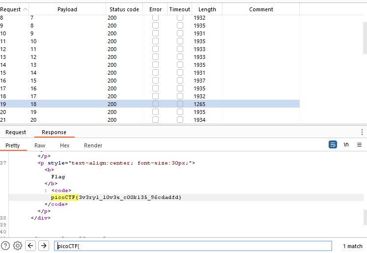

Như tên bài thì bài này có liên quan đến cookie. Nên mình nghĩ rằng bài này sẽ thay đổi cookie để lấy được flag.

Mình dùng tính năng intruderc của BurpSuite để brute force các khả năng của cookie.

Như hình mình để payload từ 0-50.

Sau khi brute force thì các cookie có value từ 29 trở lên không tồn tại

Xem phần reponse kết hợp với tìm kiếm mình tìm được value = 18 và lấy được flag.

Flag: picoCTF{3v3ry1_l0v3s_c00k135_96cdadfd}