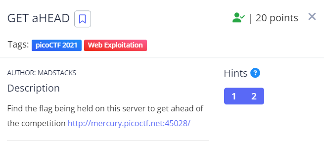
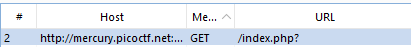
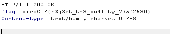

Trong bài này mình có sử dụng BurpSuite.

Đầu tiên mình check sources code nhưng không có gì. Tiếp đó mình sử dụng BurpSuite để proxy.
Mình để ý thấy tên đề bài là GET aHEAD nên rất có thể để lấy được flag mình cần thay đổi restAPI
Trong những gói tin bắt được mình thấy có một gói tin có dùng GET 

Mình thử dùng tính năng Repeater của BurpSuite để thay đổi API rồi gửi lại request và lấy được flag.

Flag: picoCTF{r3j3ct_th3_du4l1ty_775f2530}

